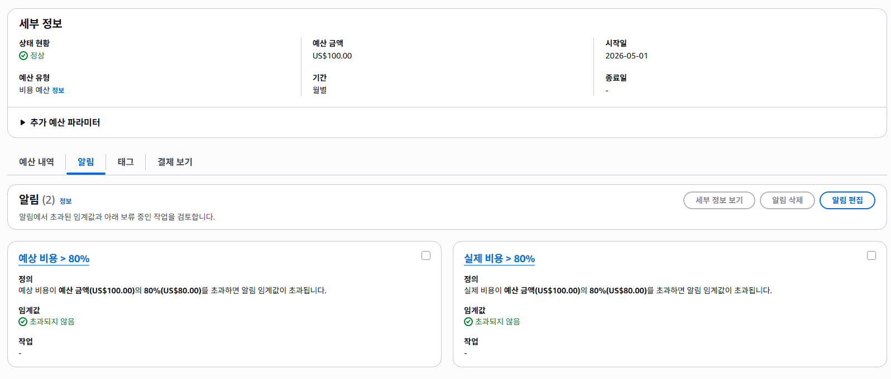
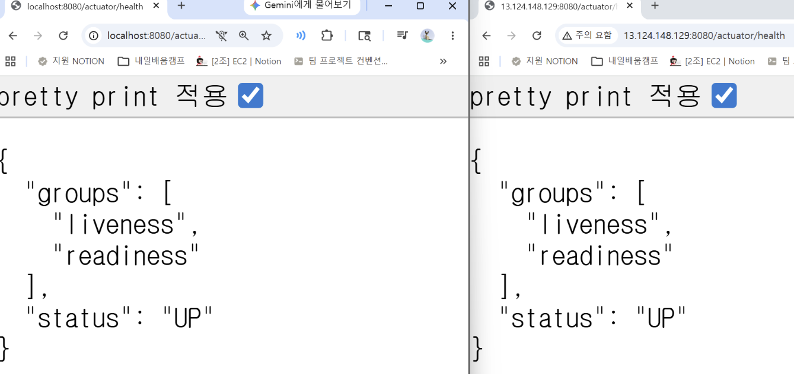

# AWS Team Profile API

## 1. 프로젝트 소개

AWS Team Profile API는 Spring Boot로 구현한 팀원 프로필 API를 AWS 클라우드 환경에 배포하는 프로젝트입니다.

팀원 정보 등록·조회·수정과 프로필 이미지 업로드 기능을 구현하고, Amazon EC2, Amazon RDS for MySQL, Amazon S3, AWS IAM Role, AWS Systems Manager Parameter Store를 활용해 실제 운영 환경에 가까운 백엔드 배포 구조를 구성하는 것을 목표로 합니다.

핵심은 단순한 CRUD API 구현이 아니라, 애플리케이션 서버가 상태를 직접 들고 있지 않도록 서버, 데이터베이스, 파일 저장소, 민감정보, 권한을 각각 분리한 Stateless 아키텍처를 구성하는 것입니다.

이를 통해 로컬에서 동작하는 Spring Boot 애플리케이션을 AWS 클라우드 환경에서 운영 가능한 백엔드 서비스 구조로 확장하는 과정을 학습합니다.

---

## 2. 프로젝트 목표

핵심 목표는 Spring Boot 애플리케이션을 AWS 환경에 배포하고, 애플리케이션 서버가 상태를 직접 저장하지 않는 Stateless 아키텍처를 구성하는 것입니다.

[상세 목표]

- 팀원 정보를 등록하고 조회하는 REST API를 구현
- 로컬 개발 환경에서는 빠른 테스트를 위해 H2 Database를 사용
- AWS 운영 환경에서는 Amazon RDS for MySQL을 사용
- 이를 위해 Spring Boot Profile을 `local`과 `prod`로 분리
- 프로필 이미지는 Amazon EC2 로컬 디스크가 아닌 Amazon S3에 저장
- Amazon S3 버킷은 Public Access를 차단하고, Presigned URL을 통해 제한된 시간 동안만 이미지에 접근하도록 구성
- DB 접속 정보와 확인용 설정값은 AWS Systems Manager Parameter Store에 저장하여 민감정보가 코드에 노출되지 않도록 구성
- Amazon EC2에는 Amazon S3 접근 권한을 가진 AWS IAM Role을 연결하여 Access Key를 코드나 설정 파일에 직접 저장하지 않음
- Spring Boot Actuator를 통해 애플리케이션 상태를 확인할 수 있도록 구성
- API 요청과 예외 상황을 로그로 기록하여 운영 중 문제를 확인할 수 있도록 구성

---

## 3. 핵심 아키텍처 방향

애플리케이션 서버가 상태를 직접 저장하지 않는 Stateless 아키텍처를 목표로 합니다.

Amazon EC2는 Spring Boot 애플리케이션 실행과 API 요청 처리를 담당하고, 영구 보관이 필요한 데이터와 설정 정보는 목적에 따라 별도의 AWS 서비스에 분리하여 저장합니다.   
이를 통해 Amazon EC2 인스턴스가 재시작되거나 교체되더라도 핵심 데이터는 유지되고, 애플리케이션을 다시 실행해 서비스를 복구할 수 있는 구조를 구성합니다.

```text
[사용자]
   ↓ HTTP 요청
[Amazon EC2 - Spring Boot Application]
   ├── 팀원 정보 저장/조회 → [Amazon RDS for MySQL]
   ├── 프로필 이미지 업로드/조회 → [Amazon S3]
   └── DB 접속 정보 조회 → [AWS Systems Manager Parameter Store]
```

---

## 4. 주요 기능

| 기능 | 설명 |
|---|---|
| 팀원 등록 | 이름, 나이, MBTI를 입력받아 팀원 정보를 저장 |
| 팀원 전체 조회 | 저장된 모든 팀원 정보를 조회 |
| 팀원 단건 조회 | ID를 기준으로 특정 팀원 정보를 조회 |
| 팀원 정보 수정 | ID를 기준으로 특정 팀원의 정보를 수정 |
| 팀원 삭제 | ID를 기준으로 특정 팀원의 정보를 삭제 |
| 프로필 이미지 업로드 | MultipartFile로 이미지를 받아 Amazon S3에 업로드 |
| 프로필 이미지 조회 | Presigned URL을 발급하여 제한된 시간 동안 이미지를 조회 |

---

## 5. 환경 분리 및 운영 구성

| 항목 | 설명 |
|---|---|
| Profile 분리 | Spring Boot Profile을 `local` / `prod`로 분리하여 로컬 환경과 운영 환경을 구분 |
| 로컬 DB | 로컬 환경에서는 H2 Database를 사용 |
| 운영 DB | 운영 환경에서는 Amazon RDS for MySQL을 사용 |
| 설정값 관리 | DB 접속 정보와 확인용 설정값을 AWS Systems Manager Parameter Store에서 관리 |
| 헬스 체크 | Spring Boot Actuator의 `/actuator/health`를 통해 애플리케이션 상태를 확인 |
| 로그 기록 | API 요청은 `INFO` 레벨로 기록하고, 예외 발생 시 `ERROR` 레벨로 스택트레이스를 기록 |

---

## 6. 보안 설계 방향

| 항목 | 설명 |
|---|---|
| RDS 접근 제어 | Amazon RDS Security Group의 Inbound Source를 전체 IP 대역이 아닌 Amazon EC2 Security Group ID로 제한 |
| 민감정보 관리 | DB 접속 정보(`url`, `username`, `password`)와 확인용 파라미터를 AWS Systems Manager Parameter Store에 저장 |
| 설정값 주입 | Spring Boot 실행 시 AWS Systems Manager Parameter Store 값을 주입받아 Amazon RDS for MySQL에 연결 |
| S3 Public Access 차단 | Amazon S3 버킷은 모든 Public Access를 차단한 상태로 생성 |
| 이미지 저장 위치 | 프로필 이미지는 Amazon EC2 로컬 디스크가 아닌 Amazon S3 버킷에 저장 |
| Access Key 관리 | AWS Access Key를 코드나 설정 파일에 직접 저장하지 않음 |
| S3 접근 권한 | Amazon EC2에 Amazon S3 접근 권한을 가진 AWS IAM Role을 연결 |
| 이미지 접근 제어 | 프로필 이미지는 Presigned URL을 통해서만 다운로드할 수 있도록 구성 |
| Presigned URL 만료 | Presigned URL의 유효기간은 과제 요구사항에 따라 7일로 설정 |

---

## 7. AWS 인프라 구성 계획

| AWS 리소스 | 사용 목적 |
|---|---|
| AWS Budgets | 월 예산 설정 및 비용 알림 |
| Amazon VPC | Amazon EC2와 Amazon RDS를 배치할 네트워크 환경 구성 |
| Public Subnet | 외부 요청을 받을 Amazon EC2 배치 |
| Amazon EC2 | Spring Boot 애플리케이션 실행 |
| Amazon RDS for MySQL | 팀원 정보와 프로필 이미지 식별 정보 저장 |
| Amazon S3 | 프로필 이미지 파일 저장 |
| AWS Systems Manager Parameter Store | DB 접속 정보와 확인용 설정값 저장 |
| AWS IAM Role | Amazon EC2가 Access Key 없이 Amazon S3 등 AWS 서비스에 접근할 수 있도록 권한 부여 |
| Security Group | Amazon EC2와 Amazon RDS의 네트워크 접근 제어 |

---

## 8. 도메인 설계

### Member

| 필드명 | 타입 | 설명 |
|---|---|---|
| id | Long | 팀원 ID |
| name | String | 팀원 이름 |
| age | Integer | 팀원 나이 |
| mbti | String | 팀원 MBTI |
| profileImageKey | String | Amazon S3에 저장된 프로필 이미지 객체 Key |
| createdAt | LocalDateTime | 생성 시간 |
| updatedAt | LocalDateTime | 수정 시간 |

*프로필 이미지는 DB에 직접 저장하지 않고, Amazon S3에 저장한 뒤 DB에는 Amazon S3 객체 Key만 저장

---

## 9. API 명세

API 명세는 실제 Controller 구현 결과와 로컬 테스트 결과를 기준으로 정리할 예정입니다.

---

## 10. 제출 증빙 자료

| 단계 | 제출 자료                                                      |
|---|------------------------------------------------------------|
| LV 0 `필수` | AWS Budgets 설정 화면 캡처                                       |
| LV 1 `필수` | Amazon EC2 Public IP, `/actuator/health` URL               |
| LV 2 `필수` | `/actuator/info` URL, Amazon RDS Security Group 인바운드 규칙 캡처 |
| LV 3 `필수` | Presigned URL 1개, 만료 시간 또는 접근 성공 스크린샷                      |
| LV 4 `도전` | GitHub Actions 성공 화면, `docker ps` 실행 화면                    |
| LV 5 `도전` | HTTPS 도메인 URL, Target Group Healthy 화면                     |
| LV 6 `도전` | Amazon CloudFront 이미지 URL                                  |

### LV 0. AWS Budgets 설정 화면 캡처

- 월 예산: `$100`
- 예산 알림 기준: `80%` 도달 시 이메일 알림



### LV 1. Amazon EC2 Public IP, `/actuator/health` URL
- EC2 Public IP: `13.124.148.129`
- Health Check URL: `http://13.124.148.129:8080/actuator/health`

```text

왼쪽 localhost:8080
http://localhost:8080/actuator/health 
→ 로컬 PC에서 실행 중인 서버

오른쪽 13.124.148.129:8080
http://13.124.148.129:8080/actuator/health
→ EC2에서 실행 중인 서버

```


---