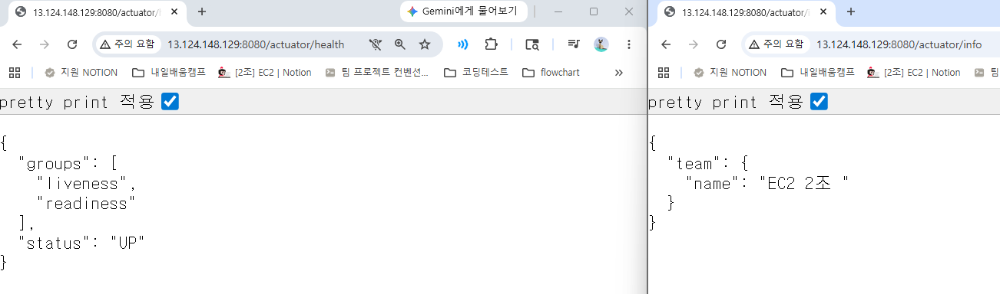
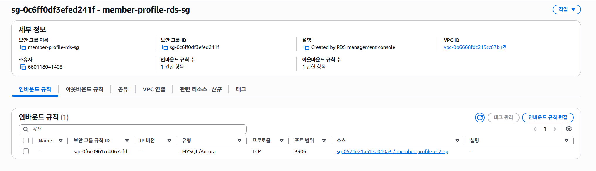
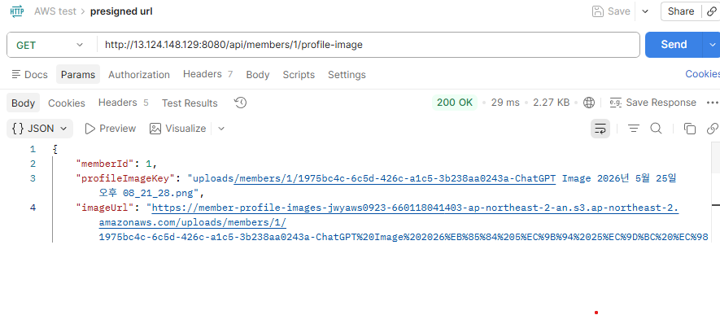
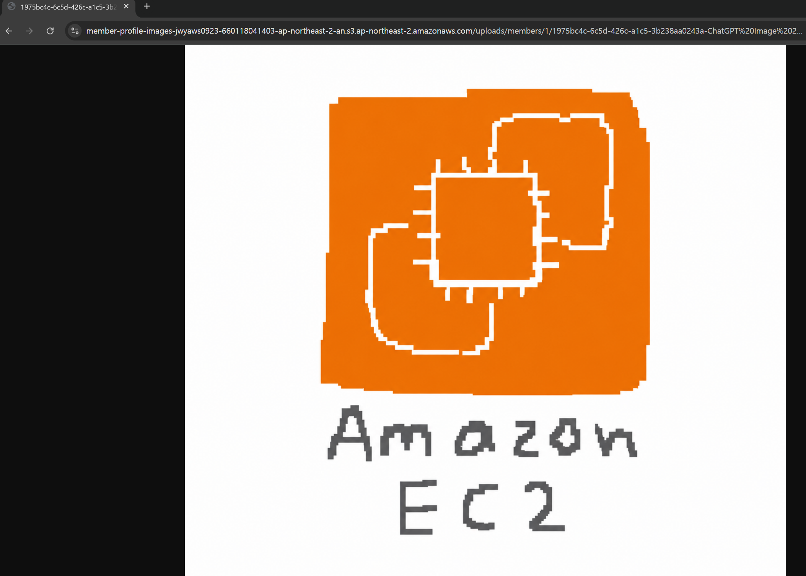
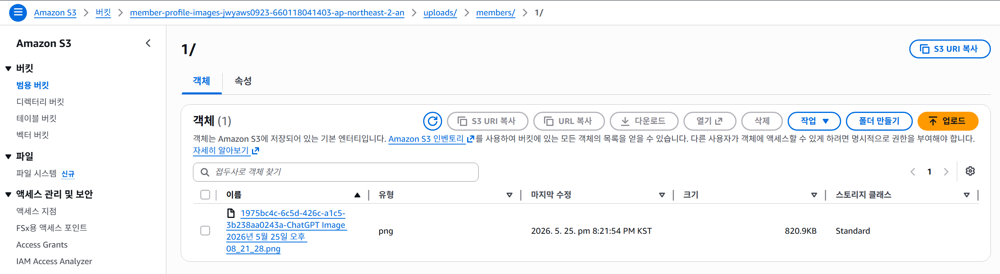
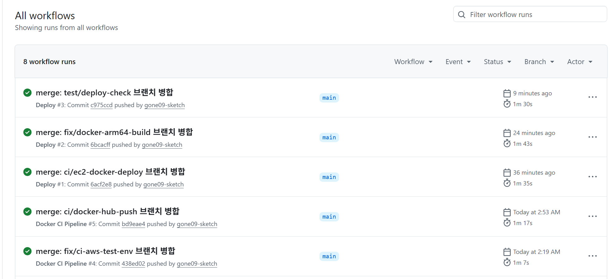
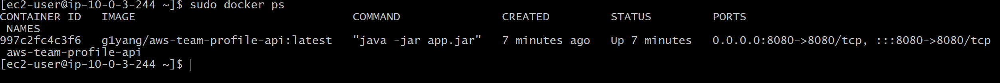
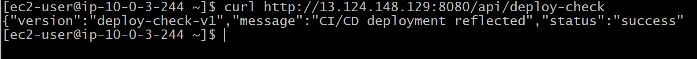

# AWS Member Profile API

## 1. 프로젝트 소개

AWS Member Profile API는 Spring Boot로 구현한 팀원 프로필 API를 AWS 클라우드 환경에 배포하는 프로젝트입니다.

팀원 정보 등록·조회·수정·삭제와 프로필 이미지 업로드 기능을 구현하고, Amazon EC2, Amazon RDS for MySQL, Amazon S3, AWS IAM Role, AWS Systems Manager Parameter Store를 활용해 실제 운영 환경에 가까운 백엔드 배포 구조를 구성하는 것이 목표입니다.

핵심은 단순한 CRUD API 구현이 아니라, 애플리케이션 서버가 상태를 직접 들고 있지 않도록 서버, 데이터베이스, 파일 저장소, 민감정보, 권한을 각각 분리한 Stateless 아키텍처 구성입니다.

이를 통해 로컬에서 동작하는 Spring Boot 애플리케이션을 AWS 클라우드 환경에서 운영 가능한 백엔드 서비스 구조로 확장하는 과정을 학습했습니다.

---

## 2. 프로젝트 목표

핵심 목표는 Spring Boot 애플리케이션을 AWS 환경에 배포하고, 애플리케이션 서버가 상태를 직접 저장하지 않는 Stateless 아키텍처 구성입니다.

[상세 목표]

- 팀원 정보를 등록·조회·수정·삭제하는 REST API 구현
- 로컬 개발 환경에서는 빠른 테스트를 위해 H2 Database 사용
- AWS 운영 환경에서는 Amazon RDS for MySQL 사용
- Spring Boot Profile을 `local`과 `prod`로 분리
- 프로필 이미지는 Amazon EC2 로컬 디스크가 아닌 Amazon S3에 저장
- Amazon S3 버킷은 Public Access를 차단하고, Presigned URL을 통해 제한된 시간 동안만 이미지에 접근하도록 구성
- DB 접속 정보와 확인용 설정값은 AWS Systems Manager Parameter Store에 저장하여 민감정보가 코드에 노출되지 않도록 구성
- Amazon EC2에는 AWS IAM Role을 연결하여 Access Key를 코드나 설정 파일에 직접 저장하지 않도록 구성
- EC2에 연결된 IAM Role을 통해 Parameter Store, KMS, S3에 접근하도록 구성
- Spring Boot Actuator를 통해 애플리케이션 상태 확인
- API 요청과 예외 상황을 로그로 기록하여 운영 중 문제를 확인할 수 있도록 구성

---

## 3. 핵심 아키텍처 방향

애플리케이션 서버가 상태를 직접 저장하지 않는 Stateless 아키텍처를 목표로 구성했습니다.

Amazon EC2는 Spring Boot 애플리케이션 실행과 API 요청 처리를 담당하고, 영구 보관이 필요한 데이터와 설정 정보는 목적에 따라 별도의 AWS 서비스에 분리하여 저장했습니다.

이를 통해 Amazon EC2 인스턴스가 재시작되거나 교체되더라도 핵심 데이터는 유지되고, 애플리케이션을 다시 실행해 서비스를 복구할 수 있는 구조로 구성했습니다.

```text
[사용자]
   ↓ HTTP 요청
[Amazon EC2 - Spring Boot Application]
   ├── 팀원 정보 저장/조회 → [Amazon RDS for MySQL]
   ├── 프로필 이미지 업로드/조회/삭제 → [Amazon S3]
   ├── DB 접속 정보 조회 → [AWS Systems Manager Parameter Store]
   └── AWS 서비스 접근 권한 → [AWS IAM Role]
```

---

## 4. 주요 기능

| 기능 | 설명 |
|---|---|
| 팀원 등록 | 이름, 나이, MBTI를 입력받아 팀원 정보 저장 |
| 팀원 전체 조회 | 저장된 모든 팀원 정보 조회 |
| 팀원 단건 조회 | ID를 기준으로 특정 팀원 정보 조회 |
| 팀원 정보 수정 | ID를 기준으로 특정 팀원 정보 수정 |
| 팀원 삭제 | ID를 기준으로 특정 팀원 정보 삭제 |
| 프로필 이미지 업로드 | MultipartFile로 이미지를 받아 Amazon S3에 업로드 |
| 프로필 이미지 조회 | DB에 저장된 S3 object key를 기준으로 Presigned URL 생성 |
| 프로필 이미지 삭제 | 멤버 삭제 또는 이미지 교체 시 S3에 저장된 기존 이미지 객체 삭제 |

---

## 5. 환경 분리 및 운영 구성

| 항목 | 설명 |
|---|---|
| Profile 분리 | Spring Boot Profile을 `local` / `prod`로 분리하여 로컬 환경과 운영 환경 구분 |
| 로컬 DB | 로컬 환경에서는 H2 Database 사용 |
| 운영 DB | 운영 환경에서는 Amazon RDS for MySQL 사용 |
| 설정값 관리 | DB 접속 정보, 확인용 설정값, S3 버킷 이름을 AWS Systems Manager Parameter Store에서 관리 |
| 헬스 체크 | Spring Boot Actuator의 `/actuator/health`를 통한 애플리케이션 상태 확인 |
| 정보 확인 | Spring Boot Actuator의 `/actuator/info`를 통한 Parameter Store 주입값 확인 |
| 로그 기록 | API 요청은 `INFO` 레벨로 기록하고, 예외 발생 시 `ERROR` 레벨로 스택트레이스 기록 |

---

## 6. 보안 설계 방향

| 항목 | 설명 |
|---|---|
| RDS 접근 제어 | Amazon RDS Security Group의 Inbound Source를 전체 IP 대역이 아닌 Amazon EC2 Security Group ID로 제한 |
| 민감정보 관리 | DB 비밀번호를 SecureString으로 저장하여 코드와 GitHub 저장소에 노출되지 않도록 구성 |
| 설정값 관리 | DB 접속 정보, 확인용 파라미터, S3 버킷 이름을 AWS Systems Manager Parameter Store에 저장 |
| SecureString 복호화 | EC2 IAM Role에 KMS 복호화 권한을 부여하여 Parameter Store의 SecureString 값을 읽을 수 있도록 구성 |
| S3 Public Access 차단 | Amazon S3 버킷의 모든 Public Access 차단 |
| 이미지 저장 위치 | 프로필 이미지를 Amazon EC2 로컬 디스크가 아닌 Amazon S3 버킷에 저장 |
| Access Key 관리 | AWS Access Key를 코드나 설정 파일에 직접 저장하지 않도록 구성 |
| S3 접근 권한 | Amazon EC2에 S3 접근 권한이 포함된 AWS IAM Role 연결 |
| 이미지 접근 제어 | Presigned URL을 통해서만 프로필 이미지에 접근할 수 있도록 구성 |
| Presigned URL 만료 | 과제 요구사항에 따라 Presigned URL 유효기간을 7일로 설정 |

### S3 IAM Policy 설정 이유

EC2에서 실행되는 Spring Boot 애플리케이션이 Access Key 없이 S3에 접근할 수 있도록 IAM Role에 S3 접근 정책을 연결했습니다.

현재 프로젝트는 Member CRUD 기능을 제공하므로, 프로필 이미지도 멤버 데이터의 생명주기와 함께 관리되어야 한다고 판단했습니다.

적용한 주요 권한은 다음과 같습니다.

- `s3:PutObject`
  - 멤버 프로필 이미지를 S3에 업로드하기 위한 권한
- `s3:GetObject`
  - 저장된 프로필 이미지를 조회하거나 Presigned URL을 생성하기 위한 권한
- `s3:DeleteObject`
  - 멤버 삭제 또는 프로필 이미지 교체 시 S3에 저장된 기존 이미지 객체를 삭제하기 위한 권한

Member 삭제 API가 존재하는 상황에서 DB의 멤버 데이터만 삭제하고 S3 객체를 남겨두면, 사용하지 않는 이미지 파일이 계속 누적되고 저장 비용 증가와 리소스 관리 문제로 이어질 수 있습니다.

따라서 CRUD 흐름과 데이터 정합성을 맞추기 위해 `s3:DeleteObject` 권한을 함께 부여했습니다.

단, S3 접근 권한은 전체 AWS 리소스가 아니라 해당 버킷의 `uploads/` 경로로 제한하여, 애플리케이션이 필요한 프로필 이미지 객체에 대해서만 업로드, 조회, 삭제할 수 있도록 구성했습니다.

---

## 7. AWS 인프라 구성 계획

| AWS 리소스 | 사용 목적 |
|---|---|
| AWS Budgets | 월 예산 설정 및 비용 알림 |
| Amazon VPC | Amazon EC2와 Amazon RDS를 배치할 네트워크 환경 구성 |
| Public Subnet | 외부 요청을 받을 Amazon EC2 배치 |
| Amazon EC2 | Spring Boot 애플리케이션 실행 |
| Amazon RDS for MySQL | 팀원 정보와 프로필 이미지 식별 정보 저장 |
| Amazon S3 | 프로필 이미지 파일 저장 |
| AWS Systems Manager Parameter Store | DB 접속 정보, 확인용 설정값, S3 버킷 이름 저장 |
| AWS IAM Role | Amazon EC2가 Access Key 없이 Parameter Store, KMS, S3에 접근할 수 있도록 권한 부여 |
| Security Group | Amazon EC2와 Amazon RDS의 네트워크 접근 제어 |

### Parameter Store 구성

운영 환경에서 사용하는 DB 접속 정보, 확인용 설정값, S3 버킷 이름은 AWS Systems Manager Parameter Store에 저장했습니다.

이를 통해 DB 접속 정보가 `application-prod.yml`이나 GitHub 저장소에 직접 노출되지 않도록 구성했습니다.

<details>
<summary>Parameter Store 설정 목록</summary>

| Parameter Name | Type | 사용 목적 |
|---|---|---|
| `/member-profile-api/prod/DB_URL` | String | Amazon RDS for MySQL JDBC URL |
| `/member-profile-api/prod/DB_USERNAME` | String | RDS 접속 사용자명 |
| `/member-profile-api/prod/DB_PASSWORD` | SecureString | RDS 접속 비밀번호 |
| `/member-profile-api/prod/TEAM_NAME` | String | `/actuator/info` 확인용 팀 이름 |
| `/member-profile-api/prod/S3_BUCKET_NAME` | String | 프로필 이미지 저장용 S3 버킷 이름 |

`S3_BUCKET_NAME`은 민감정보는 아니지만, 애플리케이션 코드가 아니라 배포 환경에 따라 달라질 수 있는 인프라 설정값이므로 Parameter Store에서 관리했습니다.

</details>

Spring Boot `prod` profile에서는 `aws-parameterstore:/member-profile-api/prod/` 경로를 import하여 Parameter Store 값을 주입받습니다.

`DB_PASSWORD`는 민감정보이므로 `SecureString`으로 저장했고, EC2 IAM Role에 KMS 복호화 권한을 부여했습니다.

<br>

### IAM Role 구성

EC2에서 실행되는 Spring Boot 애플리케이션은 Access Key를 직접 사용하지 않고 IAM Role을 통해 AWS 서비스에 접근합니다.

<details>
<summary>IAM Role 및 Policy 구성</summary>

- Role name: `member-profile-ec2-app-role`

| Policy | 사용 목적 |
|---|---|
| `AmazonSSMReadOnlyAccess` | Parameter Store 값 조회 |
| `member-profile-kms-decrypt-policy` | Parameter Store SecureString 복호화 |
| `member-profile-s3-profile-image-policy` | S3 프로필 이미지 업로드, 조회, 삭제 |

</details>

이 구조를 통해 Spring Boot 애플리케이션은 Access Key를 코드에 직접 저장하지 않고도 EC2에 연결된 IAM Role 권한으로 Parameter Store와 S3에 접근할 수 있습니다.

---

## 8. 도메인 설계

### Member

| 필드명 | 타입 | 설명 |
|---|---|---|
| id | Long | 팀원 ID |
| name | String | 팀원 이름 |
| age | Integer | 팀원 나이 |
| mbti | String | 팀원 MBTI |
| profileImageKey | String | Amazon S3에 저장된 프로필 이미지 객체 Key |
| createdAt | LocalDateTime | 생성 시간 |
| updatedAt | LocalDateTime | 수정 시간 |

프로필 이미지는 DB에 직접 저장하지 않고, Amazon S3에 저장한 뒤 DB에는 Amazon S3 객체 Key만 저장했습니다.

---

## 9. API 명세

| Method | URL | 설명 |
|---|---|---|
| POST | `/api/members` | 팀원 등록 |
| GET | `/api/members` | 팀원 전체 조회 |
| GET | `/api/members/{memberId}` | 팀원 단건 조회 |
| PATCH | `/api/members/{memberId}` | 팀원 정보 수정 |
| DELETE | `/api/members/{memberId}` | 팀원 삭제 |
| POST | `/api/members/{memberId}/profile-image` | MultipartFile 프로필 이미지 업로드 |
| GET | `/api/members/{memberId}/profile-image` | Presigned URL 생성 및 반환 |

프로필 이미지 업로드 API는 `multipart/form-data` 형식으로 `image` 필드에 파일을 전달받습니다.

이미지는 S3 버킷의 `uploads/members/{memberId}/` 경로에 저장되며, DB에는 Presigned URL이 아니라 S3 object key인 `profileImageKey`를 저장합니다.

---

## 10. 제출 증빙 자료

| 단계 | 제출 자료 |
|---|---|
| LV 0 `필수` | AWS Budgets 설정 화면 캡처 |
| LV 1 `필수` | Amazon EC2 Public IP, `/actuator/health` URL |
| LV 2 `필수` | `/actuator/info` URL, Amazon RDS Security Group 인바운드 규칙 캡처 |
| LV 3 `필수` | Presigned URL 응답 캡처, 7일 만료 시간 확인, S3 이미지 접근 성공 및 객체 생성 캡처 |
| LV 4 `도전` | GitHub Actions 성공 화면, `docker ps` 실행 화면 |
| LV 5 `도전` | HTTPS 도메인 URL, Target Group Healthy 화면 |
| LV 6 `도전` | Amazon CloudFront 이미지 URL |

### LV 0. AWS Budgets 설정 화면 캡처

- 월 예산: `$100`
- 예산 알림 기준: `80%` 도달 시 이메일 알림


<br>

### LV 1. Amazon EC2 Public IP, `/actuator/health` URL

- EC2 Public IP: `13.124.148.129`
- Health Check URL: `http://13.124.148.129:8080/actuator/health`

```text
왼쪽 localhost:8080
http://localhost:8080/actuator/health 
→ 로컬 PC에서 실행 중인 서버

오른쪽 13.124.148.129:8080
http://13.124.148.129:8080/actuator/health
→ EC2에서 실행 중인 서버
```


<br>

### LV 2. RDS 연결 및 Parameter Store 검증

- Actuator Info URL: `http://13.124.148.129:8080/actuator/info`
- Parameter Store에 저장한 `TEAM_NAME` 값이 `/actuator/info`에서 조회되는 것을 확인
- EC2 Security Group을 Source로 지정하여 RDS Security Group 인바운드 규칙을 구성




<br>

### LV 3. S3 프로필 이미지 저장 및 Presigned URL 검증

- `POST /api/members/{id}/profile-image` 요청으로 MultipartFile 이미지를 S3 버킷의 `uploads/` 경로에 업로드하는 것을 확인
- DB에는 Presigned URL이 아니라 S3 object key인 `profileImageKey`를 저장
- `GET /api/members/{id}/profile-image` 요청 시 `profileImageKey`를 기준으로 Presigned URL을 생성하여 반환
- 실제 응답 URL의 `X-Amz-Expires=604800` 값을 통해 Presigned URL 유효기간이 7일로 설정된 것을 확인
- 발급된 Presigned URL로 브라우저에서 S3 이미지 객체에 정상 접근되는 것을 확인





<br>

### LV 4. GitHub Actions 성공 화면, `docker ps` 실행 화면

#### 1. GitHub Actions 배포 워크플로우 성공 확인

- `main` 브랜치에 코드가 병합되면 GitHub Actions의 `Deploy` 워크플로우가 실행되도록 구성

배포 워크플로우는 다음 순서로 진행됩니다.

1. Gradle build/test 실행
2. Docker 이미지 빌드
3. Docker Hub에 이미지 push
4. EC2 서버에 SSH 접속
5. 최신 Docker 이미지 pull
6. 기존 컨테이너 중지 및 삭제
7. 새 컨테이너 실행



<br>

#### 2. EC2 Docker 컨테이너 실행 확인

- EC2 서버에 접속한 뒤 `docker ps` 명령어로 컨테이너가 정상 실행 중인지 확인
- 실행 중인 컨테이너 목록에서 `aws-team-profile-api` 컨테이너가 `Up` 상태이며, `8080` 포트로 정상 실행 중인 것을 확인

```bash
docker ps
```


<br>

#### 3. 코드 수정 후 자동 배포 반영 확인

- 배포 반영 여부를 확인하기 위해 테스트용 API를 추가한 뒤, GitHub에 push 및 `main` 브랜치 병합을 진행
- GitHub Actions가 자동으로 실행되었고, EC2에 새 Docker 이미지가 배포된 뒤 API 응답을 통해 변경사항이 정상 반영된 것을 확인

```bash
curl http://13.124.148.129:8080/api/deploy-check
```

